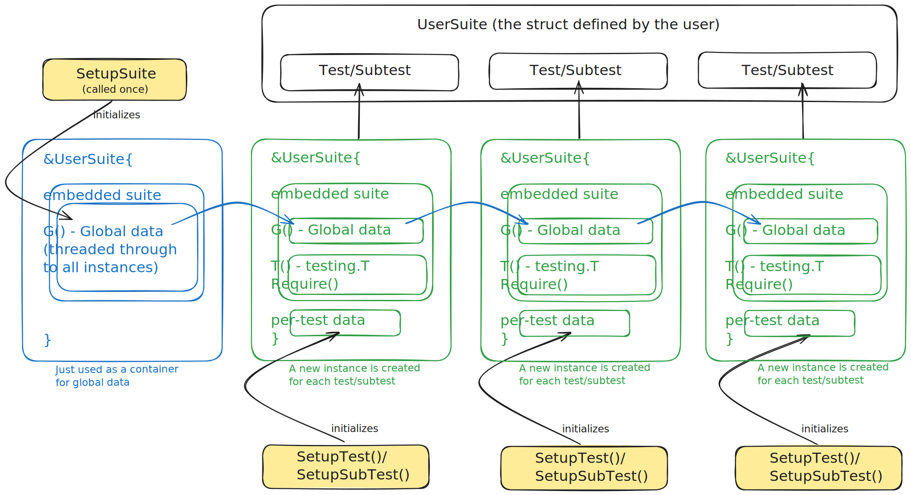

[](https://github.com/varunbpatil/testify/actions/workflows/ci.yml)

# Parallel Testify Suite

The stretchr/testify suite [does not
support](https://redirect.github.com/stretchr/testify/blob/master/README.md#suite-package) parallel
tests, which makes it, in my opinion, unusable in modern Go applications. The stretchr/testify
project has [no plan](https://github.com/stretchr/testify/discussions/1560) to support it because it
requires backward-incompatible changes and there is no plan for a v2 version.

You can just use the stdlib `testing` package if you want parallel tests. Its 2025!! You almost certainly do. But,
`Suite` comes with a host of useful helper methods that have the potential to reduce a lot of boilerplate code.
Also, if you are already using testify suite, it should be possible to upgrade to the parallel version with minimal
code changes. This package aims to do just that.

## Usage

See [suite_test.go](suite/suite_test.go) for a comprehensive example utilizing all the available features.
You will also see that in [suite_test.go](suite/suite_test.go), we implement all of the same tests from
the [stretchr/testify suite](https://redirect.github.com/stretchr/testify/blob/master/suite/suite_test.go)
but modified to use the parallel testify suite implemented by this package.

## Other parallel testify suite implementations

Here is one that I know of - https://github.com/huma-engineering/testify

This is basically a fork of the PR - [Add support for parallel sub-tests and remove suite.Suite
pseudo-interitance](https://redirect.github.com/stretchr/testify/pull/1109). Apart from being mostly
unmaintained, it simply doesn't work as you can see from this
[issue](https://redirect.github.com/huma-engineering/testify/issues/5) where the teardown methods
are called before the (parallel) sub-tests actually complete.

The reason for this is simple. You cannot use deferred functions to execute teardown
code when working with parallel sub-tests. The parallel sub-tests won't even start running
until after the deferred function has executed and the parent test has returned. This is
the whole reason why [Cleanup](https://golang.org/pkg/testing/#T.Cleanup) was introduced
in Go 1.14.

## How does it work?



Here is a very simple outline of using this package.

```go
import (
    "github.com/varunbpatil/testify/suite"
    
    // This import is optional. It is only required for CodeLens support
    // in vscode with the vscode-go extension.
    _ "github.com/stretchr/testify/suite"
)

type ParallelSuite struct {
    // This must be embedded.
    *suite.Suite[ParallelSuite, GlobalData]

    // All the per-test data goes here.
    // This will be unique to each test/sub-test.
    g *goldie.Goldie
    h *httpexpect.Expect
}

type GlobalData struct {
	// All the global data (common to all tests) is stored here.
    // Ex: DB connections, gRPC clients, ...
}

// Suite setup and teardown.
func (s *ParallelSuite) SetupSuite() { ... }
func (s *ParallelSuite) TearDownSuite() { ... }

// Test setup and teardown. 
func (s *ParallelSuite) SetupTest() { ... }
func (s *ParallelSuite) TearDownTest() { ... }

// Sub-test setup and teardown.
func (s *ParallelSuite) SetupSubTest() { ... }
func (s *ParallelSuite) TearDownSubTest() { ... }

// The entrypoint for the test.
func TestSuiteParallel(t *testing.T) {
	t.Parallel()
	suite.Run[ParallelSuite, GlobalData](t)
}

// One parallel test with multiple parallel subtests.
func (s *ParallelSuite) TestOne() {
	s.Parallel()

    // Parallel subtests.
    for _, v := range []string{"sub1", "sub2", "sub3"} {
        s.Run(v, func(s *ParallelSuite) {
            s.Parallel()
            ...
        }
    }
}
```

This gets converted to the following (roughly speaking).

```go
func TestSuiteParallel(t *testing.T) {
	t.Parallel()

    // Initialization.
    suite := ...

    // Register TearDownSuite to be executed after all sub-tests are done.
    // This is guaranteed to wait until all sub-tests are done before executing.
    t.Cleanup(func() { suite.TearDownSuite() })

    // Setup suite.
    suite.SetupSuite()

    // A sub-test is created for each of the methods in the test suite.
    t.Run("TestOne", func(t *testing.T) {
        t.Parallel()

        // Initialization of a different instance so that the per-test data 
        // and the testing.T context is unique while still sharing the same 
        // global data from `suite`.
        anotherSuiteInstance := ...

        // Register TearDownTest to be executed after all sub-tests are done.
        // This is guaranteed to wait until all sub-tests are done before executing.
        t.Cleanup(func() { anotherSuiteInstance.TearDownTest() })

        // Setup test.
        anotherSuiteInstance.SetupTest()

        // Run sub-tests.
        for _, v := range []string{"sub1", "sub2", "sub3"} {
            t.Run(v, func(t *testing.T) {
                t.Parallel()

                // Initialization of a different instance so that the per-test data 
                // and the testing.T context is unique while still sharing the same 
                // global data from `suite`.
                yetAnotherSuiteInstance := ...

                // Register TearDownSubTest to be executed after all sub-tests are done.
                // This is guaranteed to wait until all sub-tests are done before executing.
                t.Cleanup(func() { yetAnotherSuiteInstance.TearDownTest() })

                // Setup sub-test.
                yetAnotherSuiteInstance.SetupSubTest()

                ...
            })
        }
    })
}
```

As you can see, even without me showing any of the data access, the stdlib version, with its nested structure,
is much harder to grok than the parallel testify suite. This is why the parallel testify suite is so useful.

## Migrating from stretchr/testify suite

One of the goals of this package is to keep the interfaces as similar as posssible to the stretchr/testify suite.
To this end, there are no changes to the interfaces of the setup/teardown methods. The other changes listed below
are nothing that find-and-replace cannot handle.

Change
```go
type MyTestSuite struct {
    suite.Suite
}
```
to
```go
type MyTestSuite struct {
    *suite.Suite[MyTestSuite, GlobalData]

    // Per-test data
    g *goldie.Goldie
    h *httpexpect.Expect
}

type GlobalData struct {
    // Data common to all tests
    // Ex: DB connections, gRPC clients, ...
}
```

Instead of writing the test entrypoint like this:
```go
func TestEntryPoint(t *testing.T) {
    t.Parallel()
    suite.Run(t, new(MyTestSuite))
}
```

write it like this:
```go
func TestEntryPoint(t *testing.T) {
    t.Parallel()
    suite.Run[MyTestSuite, GlobalData](t)
}
```

Instead of running subtests like this:
```go
func (s *MyTestSuite) TestOne() {
    s.Run("sub1", func() {
        ...
    })
}
```

run them like this:
```go
func (s *MyTestSuite) TestOne() {
    s.Run("sub1", func(s *MyTestSuite) {
        // You now have access to per-sub-test unique data and global data via `s`.
        // s.someLocalData
        // s.G().someGlobalData
    })
}
```


Access global data anywhere like so:

```go
func (s *MyTestSuite) SetupSuite() { 
    s.G().myVariable = myValue
}

func (s *MyTestSuite) TestOne() {
    s.Log("running test:", s.Name(), "with global data:", s.G().myVariable)
}
```

## Test flags

The stretchr/testify suite exposes a flag named `-testify.m` to control which methods to selectively
execute in the test suite. This works in exactly the same way with the parallel testify suite.

In addition, there is new flag `-testify.x` which does the opposite of `-testify.m` in that it
excludes tests that match the regex.

## Supported Go versions

This package currently works with Go 1.18+ due to its use of generics.

## VSCode support

The [vscode-go](https://github.com/golang/vscode-go) extension relies on the `github.com/stretchr/testify/suite` package
[being imported](https://github.com/golang/vscode-go/blob/f122b06045fd67bdc0ea6bc6612ed9831932dc52/extension/src/testUtils.ts#L764)
for features like CodeLens to work. If you need these features, you must import it in your test files.

```go
import (
    "github.com/varunbpatil/testify/suite"
    
    // Completely optional. Only required for CodeLens support in vscode using the vscode-go extension.
    _ "github.com/stretchr/testify/suite"
```

## License

This project is licensed under the terms of the MIT license.
